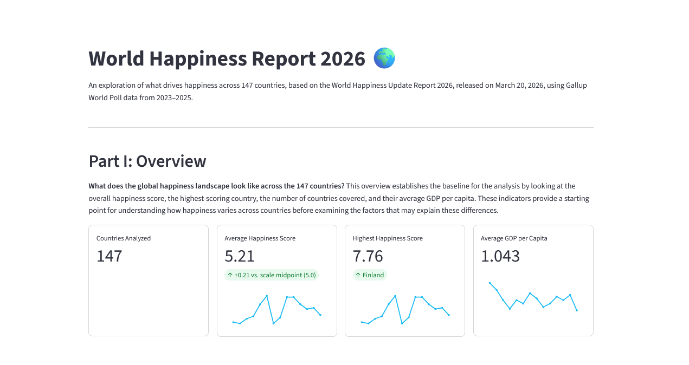
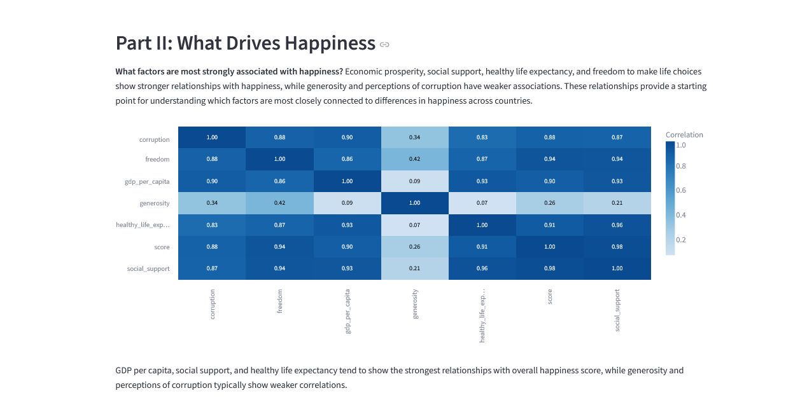
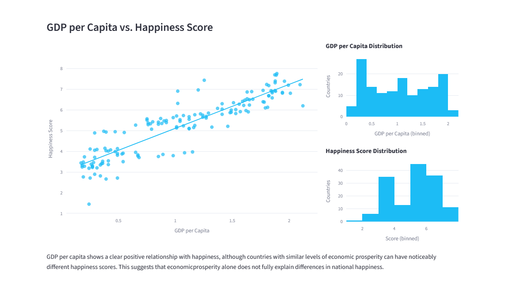
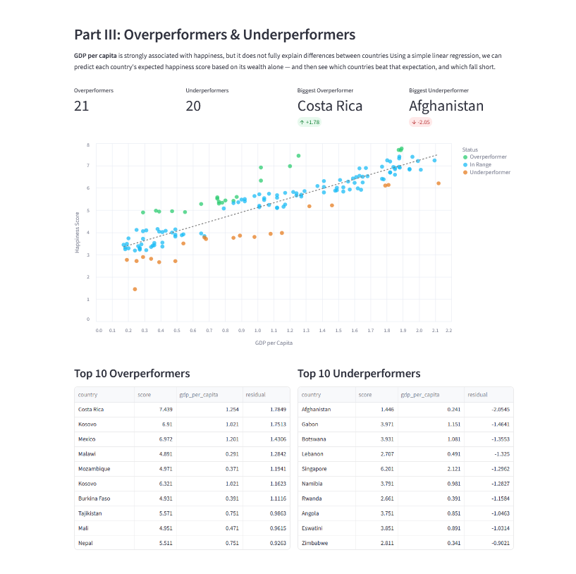
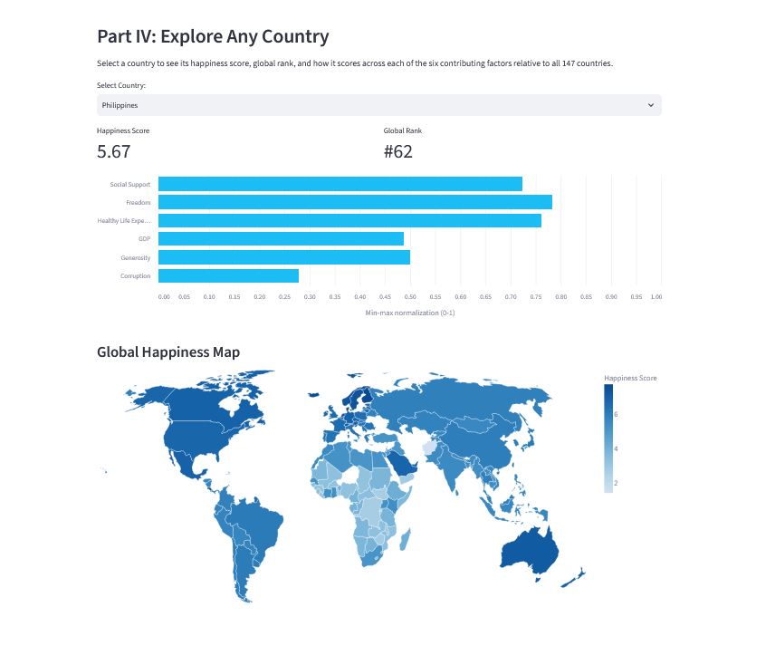

# World Happiness Report 2026 — Interactive Dashboard

An interactive Streamlit dashboard exploring what drives happiness across 147 countries, based on the World Happiness Update Report 2026 (released March 20, 2026), using Gallup World Poll data averaged over 2023–2025.

**This was my first project using Python, pandas, and Streamlit** — moving beyond Excel and Power BI to explore a code-first approach to data analysis and visualization.

## Data Source

[World Happiness Update Report 2026](https://www.kaggle.com/datasets/jummanalnahian/world-happiness-update-report-2026) on Kaggle (CC0 Public Domain) — country-level happiness scores and six explanatory factors: GDP per capita, social support, healthy life expectancy, freedom, generosity, and perceived corruption.

## Live App

*(Add your Streamlit Community Cloud deployment link here once deployed)*

## Project Structure

```
world-happiness-2026/
├── data/
│   └── world_happiness_update_report_2026.csv
├── app.py                # Streamlit interface (layout, charts, interactivity)
├── data_cleaning.py      # Data loading, cleaning, and ISO code matching
├── requirements.txt      # Python dependencies
└── README.md
```

## What's in the Dashboard

**Part I — Overview**
KPI cards for countries analyzed, average happiness score, the highest-scoring country, and average GDP per capita, each paired with a distribution sparkline showing where that metric sits relative to all 147 countries.



**Part II — What Drives Happiness**
A correlation heatmap across all six factors and the overall score, plus a GDP-vs-Score scatter plot with marginal distribution histograms and an OLS trend line — showing which factors matter most, and how strong (or weak) the GDP–happiness relationship really is.





**Part III — Overperformers & Underperformers**
A simple linear regression predicts each country's expected happiness score from GDP alone. Countries whose actual score deviates more than 1 standard deviation from that prediction are flagged as overperformers (happier than their wealth predicts) or underperformers — visualized on a color-coded scatter plot, with ranked tables for the top 10 in each direction.




**Part IV — Explore Any Country**
A country selector (defaulting to the Philippines) showing that country's happiness score, global rank, a normalized bar chart across all six factors, and a world choropleth map colored by happiness score.



## Data Preparation Notes

- Column names and data types were cleaned and standardized in `data_cleaning.py`.
- ISO 3166-1 numeric country codes were added (via `pycountry`, with manual corrections for names that didn't auto-match) to enable the choropleth map, since Vega-Lite's world map topology identifies countries by numeric ID rather than name.
- All six contributing factors are min-max normalized (0–1) for the Part IV factor comparison, since they're measured on very different raw scales.

## Tools Used

Python, pandas, Streamlit, Altair/Vega-Lite, Plotly, NumPy, pycountry

## Acknowledgments

The multi-part narrative structure (sequential sections combining explanatory text with visuals) was inspired by [Streamlit's official Movies demo app](https://demo-movies.streamlit.app/). Built with guidance from Claude (Anthropic) for methodology planning, debugging, and code review.
